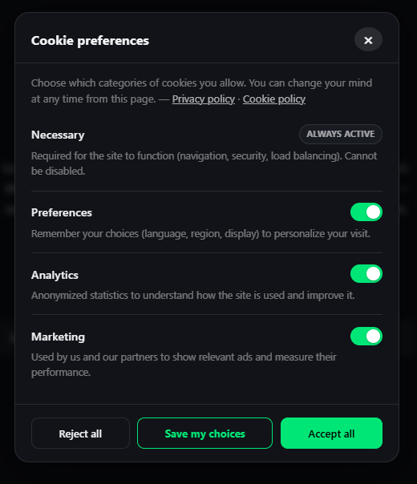
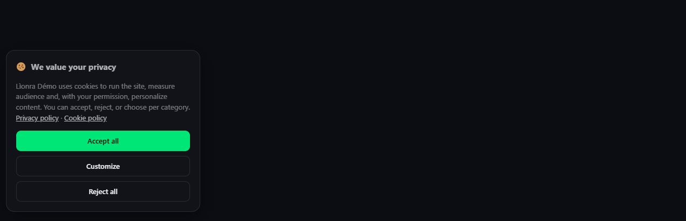
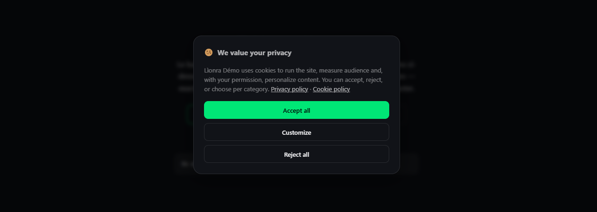
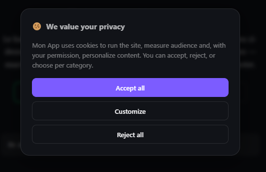

# Lìonra · CookieConsent

**A zero-dependency, plug-and-play JavaScript library for adding a GDPR/ePrivacy-friendly cookie consent banner to any web page.**
One file. No build step. Auto-display. Granular per-category consent. Compatible with vanilla JS, React, Vue, Angular, Next.js, Nuxt, CommonJS, ESM, and AMD.

> ⚠️ This library facilitates technical compliance (banner, per-purpose consent, easy withdrawal) but is not legal advice. Compliance also depends on your texts, your legal basis, and effectively blocking third-party scripts until consent is given (see [Loading scripts based on consent](#-loading-scripts-based-on-consent)). Have your implementation reviewed by counsel.

---

## 📚 Table of Contents

- [✨ Features](#-features)
- [🚀 Quick Start (CDN)](#-quick-start-cdn)
- [🚀 Quick Start (NPM)](#-quick-start-npm)
- [⚙️ Options](#-options)
- [🍪 Loading scripts based on consent](#-loading-scripts-based-on-consent)
- [🌍 Localization (`locale`)](#-localization-locale)
- [🧩 Categories](#-categories)
- [🎨 Cookie Consent Modal Layouts](#-cookie-consent-modal-layouts)
- [🎨 Cookie Panel Layout](#-cookie-panel-layout)
- [🔧 API](#-api)
- [📐 Examples](#-examples)
- [📦 Installation](#-installation)
- [🔌 Integration](#-integration)
- [📄 License](#-license)

---

## ✨ Features

- **Zero dependencies** : pure vanilla JS, ~9 KB gzip
- **Universal UMD format** : `<script>`, `require()`, ESM default/named `import`, AMD/RequireJS
- **Auto-display** : the banner appears automatically after a configurable delay
- **Granular consent** : per-category toggles (necessary / preferences / analytics / marketing by default, fully customizable)
- **Always-reopenable** : any button on your site can be bound to reopen the preferences panel, plus an optional floating bubble required by most privacy laws ( false by default )
- **3 layouts** : `bar` (full-width banner), `box` (small corner card, non-blocking), `modal` (centered dialog, dimmed backdrop, blocking)
- **Dark / Light / Auto theme** : follows `html[data-theme]`
- **i18n / localization** : built-in `en` and `fr` locales; fully customizable strings
- **Fully customizable** : accent color, layout, position, categories, button styles
- **`localStorage`-backed** : versioned and expirable consent, survives reloads
- **Versioned consent** : bump `consentVersion` to force every visitor to re-consent after a policy change
- **TypeScript types** : `cookieconsent.d.ts` included

---

## 🚀 Quick Start (CDN)

Use the standalone JavaScript file directly in your page:

```html
<script src="cookieconsent.js"></script>
<script>
  CookieConsent.init({
    companyName: "My App",
    privacyPolicyUrl: "/privacy",
  });
</script>

<!-- Anywhere on your site: footer, account page, etc. -->
<button id="btn-cookie-settings">Manage cookies</button>
```

<div align="center">



</div>

✨ That's it, the banner appears automatically after a short delay, and the button lets visitors change their mind at any time.

---

## 🚀 Quick Start (NPM)

### 1. Install

```bash
npm i lionra-cookieconsent
```

### 2. Import and initialize

```js
import CookieConsent from "lionra-cookieconsent";

CookieConsent.init({
  companyName: "My App",
  privacyPolicyUrl: "/privacy",
});
```

### 3. Add a trigger element

```html
<button id="btn-cookie-settings">Manage cookies</button>
```

### 4. Done 🎉

Your cookie consent banner is now fully functional.

---

## ⚙️ Options

| Option               | Default                  | Description                                                                       |
| -------------------- | ------------------------ | --------------------------------------------------------------------------------- |
| `companyName`        | `document.title`         | Injected into the banner text via `{company}`                                     |
| `privacyPolicyUrl`   | `null`                   | "Privacy policy" link shown in the banner/panel                                   |
| `cookiePolicyUrl`    | `null`                   | "Cookie policy" link shown in the banner/panel                                    |
| `delay`              | `600`                    | Delay (ms) before the banner auto-appears                                         |
| `autoShow`           | `true`                   | Set `false` to only open via a button or `CookieConsent.open()`                   |
| `respectDNT`         | `false`                  | If `true`, auto-rejects non-essential cookies when `navigator.doNotTrack === "1"` |
| `layout`             | `'bar'`                  | `'bar'` · `'box'` · `'modal'`                                                     |
| `position`           | `'bottom'`               | `'bottom'` · `'top'` (only for `layout: 'bar'`)                                   |
| `theme`              | `'auto'`                 | `'dark'` · `'light'` · `'auto'` (follows `html[data-theme]`)                      |
| `accent`             | `'#00e676'`              | Accent color (hex, rgb…)                                                          |
| `accentText`         | `'#000'`                 | Text color on top of the accent                                                   |
| `locale`             | `'en'`                   | UI language: `'en'`, `'fr'`, or a custom `LocaleStrings` object                   |
| `categories`         | `null`                   | Array to replace the 4 default categories                                         |
| `trigger`            | `'#btn-cookie-settings'` | CSS selector of the button(s) that reopen the preferences panel                   |
| `showFloatingButton` | `false`                  | Persistent reopen bubble, shown after the first decision (opt-in)                 |
| `floatingPosition`   | `'bottom-left'`          | `'bottom-left'` · `'bottom-right'` (bubble and `layout: 'box'`)                   |
| `saveButtonStyle`    | `'outline'`              | `'outline'` · `'solid'` · `'ghost'` — style of the "Save my choices" button       |
| `storageKey`         | `'cc-consent'`           | `localStorage` key                                                                |
| `consentVersion`     | `'1'`                    | Bump this to force every visitor to re-consent (e.g. new cookie policy)           |
| `expireDays`         | `365`                    | Days before a stored consent is considered expired                                |
| `onChange`           | `null`                   | `(consent) => void`, called on every save (accept/reject/partial)                 |
| `onAcceptAll`        | `null`                   | `(consent) => void`, called only on "Accept all"                                  |
| `onRejectAll`        | `null`                   | `(consent) => void`, called only on "Reject all"                                  |

---

## 🍪 Loading scripts based on consent

The key compliance point: **only load third-party scripts (Analytics, ad pixels, etc.) after explicit consent**, never before.

```js
CookieConsent.init({
  onChange(consent) {
    if (consent.categories.analytics) loadGoogleAnalytics();
    if (consent.categories.marketing) loadAdsPixel();
  },
});

// On page load, if consent was already stored:
if (CookieConsent.has("analytics")) loadGoogleAnalytics();
```

A DOM event is also dispatched on every change, useful if your tracking code lives elsewhere:

```js
document.addEventListener("cc:consent", (e) => {
  console.log(e.detail.categories); // { necessary: true, analytics: true, ... }
});
```

---

## 🌍 Localization (`locale`)

CookieConsent ships with built-in English (`'en'`) and French (`'fr'`) translations. You can also supply a fully custom strings object.

### Built-in locales

```js
// English (default)
CookieConsent.init({ companyName: "My App" });

// French
CookieConsent.init({ companyName: "Mon App", locale: "fr" });
```

### Partial override

Pass a `LocaleStrings` object to override only the strings you need, all other strings fall back to the `'en'` base:

```js
CookieConsent.init({
  companyName: "My App",
  locale: {
    bannerTitle: "Your data, your choice",
    btnAcceptAll: "Sounds good",
  },
});
```

### Full custom locale

Supply every translatable string, including per-category labels, to completely replace the built-in locale:

```js
CookieConsent.init({
  companyName: "My App",
  locale: {
    bannerTitle: "We value your privacy",
    bannerText:
      "{company} uses cookies to run the site and, with your permission, measure audience and personalize content.",
    btnAcceptAll: "Accept all",
    btnRejectAll: "Reject all",
    btnCustomize: "Customize",
    btnSave: "Save my choices",
    panelTitle: "Cookie preferences",
    panelIntro:
      "Choose which categories of cookies you allow. You can change your mind at any time.",
    privacyLink: "Privacy policy",
    cookieLink: "Cookie policy",
    ariaClose: "Close",
    ariaCookie: "Cookie settings",
    alwaysActive: "Always active",
    categories: {
      necessary: {
        label: "Necessary",
        description: "Required for the site to function. Cannot be disabled.",
      },
      preferences: {
        label: "Preferences",
        description: "Remember your choices to personalize your visit.",
      },
      analytics: {
        label: "Analytics",
        description:
          "Anonymized statistics to understand how the site is used.",
      },
      marketing: {
        label: "Marketing",
        description: "Used to show relevant ads and measure their performance.",
      },
    },
  },
});
```

### `LocaleStrings` reference

| Key            | Type                    | Default (en)              | Description                                        |
| -------------- | ----------------------- | ------------------------- | -------------------------------------------------- |
| `bannerTitle`  | `string`                | `'We value your privacy'` | Banner heading                                     |
| `bannerText`   | `string`                | _(built-in)_              | Banner body text. Use `{company}` as a placeholder |
| `btnAcceptAll` | `string`                | `'Accept all'`            | "Accept all" button label                          |
| `btnRejectAll` | `string`                | `'Reject all'`            | "Reject all" button label                          |
| `btnCustomize` | `string`                | `'Customize'`             | Banner button that opens the preferences panel     |
| `btnSave`      | `string`                | `'Save my choices'`       | Panel button that saves a partial selection        |
| `panelTitle`   | `string`                | `'Cookie preferences'`    | Preferences panel heading                          |
| `panelIntro`   | `string`                | _(built-in)_              | Preferences panel intro text                       |
| `privacyLink`  | `string`                | `'Privacy policy'`        | Label of the privacy policy link                   |
| `cookieLink`   | `string`                | `'Cookie policy'`         | Label of the cookie policy link                    |
| `ariaClose`    | `string`                | `'Close'`                 | `aria-label` of the panel close button             |
| `ariaCookie`   | `string`                | `'Cookie settings'`       | `aria-label` of the floating reopen bubble         |
| `alwaysActive` | `string`                | `'Always active'`         | Badge shown next to locked categories              |
| `categories`   | `Record<string, {...}>` | _(built-in)_              | Per-category `label` and `description` strings     |

---

## 🧩 Categories

Default categories, in display order:

```js
[
  { key: "necessary", locked: true, default: true }, // always on
  { key: "preferences", locked: false, default: false },
  { key: "analytics", locked: false, default: false },
  { key: "marketing", locked: false, default: false },
];
```

Replace them entirely with your own:

```js
CookieConsent.init({
  categories: [
    { key: "necessary", locked: true, default: true },
    {
      key: "ads",
      default: false,
      label: "Targeted advertising",
      description:
        "Google Ads, Meta Pixel — ad measurement and personalization.",
    },
  ],
});
```

---

## 🎨 Cookie Consent Modal Layouts

| Value   | Description                                                             |
| ------- | ----------------------------------------------------------------------- |
| `bar`   | Full-width banner, anchored to the top or bottom of the page            |
| `box`   | Small floating card in a screen corner, non-blocking                    |
| `modal` | Centered dialog with a dimmed backdrop, blocking until a choice is made |

<div align="center">






</div>

## 🎨 Cookie Panel Layout

<div align="center">


</div>

---

## 🔧 API

```ts
CookieConsent.init(options); // initialize / re-initialize the widget
CookieConsent.open(); // open the detailed preferences panel
CookieConsent.close(); // close it
CookieConsent.acceptAll(); // accept everything, save, close the banner
CookieConsent.rejectAll(); // reject everything except locked categories
CookieConsent.save({ analytics: true, marketing: false }); // partial choice
CookieConsent.getConsent(); // { categories, version, timestamp } | null
CookieConsent.has("analytics"); // boolean
CookieConsent.hasConsented(); // boolean
CookieConsent.reset(); // clear stored consent, re-show the banner
```

---

## 📐 Examples

**Centered modal, custom accent:**

```js
CookieConsent.init({
  companyName: "Mon App",
  locale: "en",
  layout: "modal",
  accent: "#7c5cff",
  accentText: "#fff",
});
```

<div align="center">



</div>

**Non-blocking corner card with a persistent reopen bubble:**

```js
CookieConsent.init({
  companyName: "My App",
  layout: "box",
  floatingPosition: "bottom-right",
  showFloatingButton: true,
});
```

**Auto-reject for Do Not Track users, no banner shown:**

```js
CookieConsent.init({
  companyName: "My App",
  respectDNT: true,
});
```

**Bump the consent version after a policy change:**

```js
CookieConsent.init({
  companyName: "My App",
  consentVersion: "2", // every visitor is asked again
});
```

**Programmatic control:**

```js
CookieConsent.open();
CookieConsent.acceptAll();
CookieConsent.reset();
```

---

## 📦 Installation

### Option 1 : Script tag (no tooling required)

```
my-project/
├── index.html
├── cookieconsent.js
└── cookieconsent.d.ts
```

```html
<script src="cookieconsent.js"></script>
<script>
  CookieConsent.init({ companyName: "My App" });
</script>
```

### Option 2 : npm / yarn

```bash
npm install lionra-cookieconsent
# or
yarn add lionra-cookieconsent
```

### Option 3 : CDN (jsDelivr / unpkg)

```html
<script src="https://cdn.jsdelivr.net/npm/lionra-cookieconsent/cookieconsent.js"></script>
<!-- or -->
<script src="https://unpkg.com/lionra-cookieconsent/cookieconsent.js"></script>
```

---

## 🔌 Integration

### Vanilla HTML

```html
<script src="cookieconsent.js"></script>
<script>
  CookieConsent.init({ companyName: "My App" });
</script>
```

### ESM (Vite, Rollup, Webpack 5+)

```js
import CookieConsent from "lionra-cookieconsent";
// or named import
import { CookieConsent } from "lionra-cookieconsent";

CookieConsent.init({ companyName: "My App" });
```

### CommonJS (Node.js, Webpack legacy, Browserify)

```js
const CookieConsent = require("lionra-cookieconsent");

CookieConsent.init({ companyName: "My App" });
```

### AMD / RequireJS

```js
define(["CookieConsent"], function (CookieConsent) {
  CookieConsent.init({ companyName: "My App" });
});
```

### React / Next.js

```jsx
import { useEffect } from "react";
import CookieConsent from "lionra-cookieconsent";

export default function App() {
  useEffect(() => {
    CookieConsent.init({
      companyName: "My App",
      onChange: (consent) => {
        if (consent.categories.analytics) {
          // load your analytics script here
        }
      },
    });
  }, []);

  return (
    <footer>
      <button id="btn-cookie-settings">Manage cookies</button>
    </footer>
  );
}
```

> CookieConsent manipulates the DOM directly, always call `init()` inside `useEffect` (React) or `onMounted` (Vue) to ensure the DOM is ready.

### Vue 3 / Nuxt

```vue
<script>
import CookieConsent from "lionra-cookieconsent";

export default {
  name: "App",

  mounted() {
    CookieConsent.init({
      companyName: "My App",
      layout: "box",
      locale: "en",
    });
  },
};
</script>

<template>
  <footer>
    <button id="btn-cookie-settings">Manage cookies</button>
  </footer>
</template>
```

**TypeScript**, `cookieconsent.d.ts` is picked up automatically by Volar/Vetur. If not, add to `tsconfig.json`:

```json
{ "compilerOptions": { "types": ["lionra-cookieconsent"] } }
```

### Angular

```ts
import { Component, AfterViewInit } from "@angular/core";
import CookieConsent from "lionra-cookieconsent";

@Component({
  selector: "app-root",
  template: `<footer>
    <button id="btn-cookie-settings">Manage cookies</button>
  </footer>`,
})
export class AppComponent implements AfterViewInit {
  ngAfterViewInit(): void {
    CookieConsent.init({ companyName: "My App" });
  }
}
```

**TypeScript**, if types are not resolved, add to `tsconfig.app.json`:

```json
{
  "compilerOptions": {
    "paths": {
      "lionra-cookieconsent": [
        "./node_modules/lionra-cookieconsent/cookieconsent.d.ts"
      ]
    }
  }
}
```

---

## 📄 License

MIT © Lìonra
